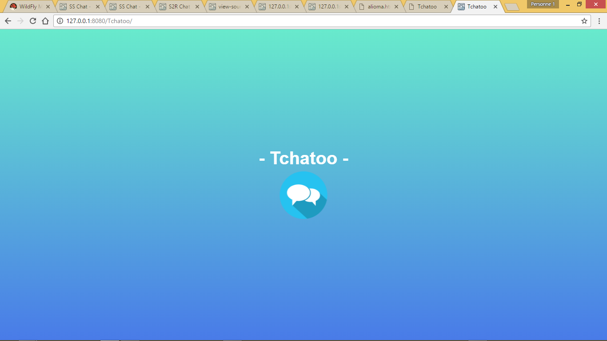
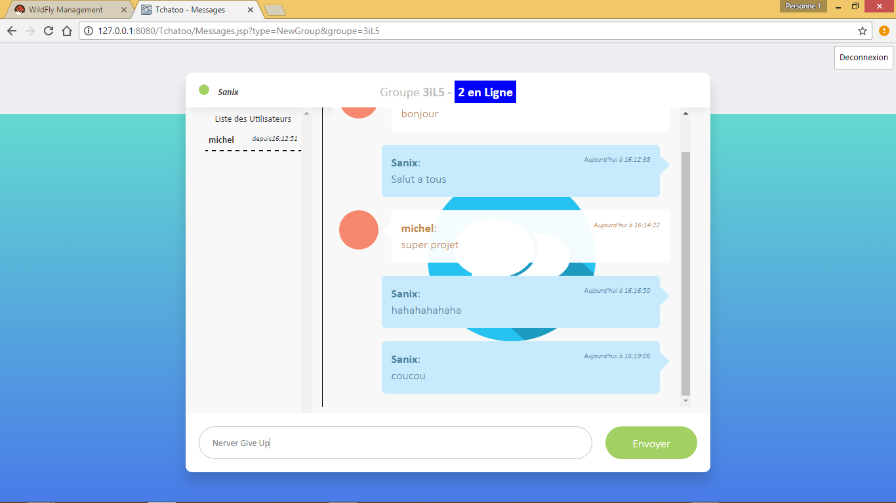

# Tchatto
Application de tchat entre amis et groupe d'amis (avec un noyau de generation dynamique de nouveau groupes si non existant) (SSH + JSP + Servlet + JAVA)

Tres simple a mettre en oeuvre et aussi tres utile:
 
<table style="width:100%;">
  <tr>
    <td></td>
    <td></td>
    <td></td>
  </tr>
</table>
