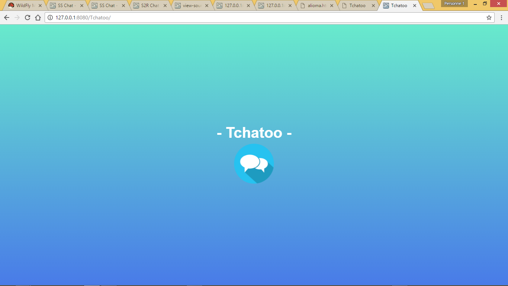
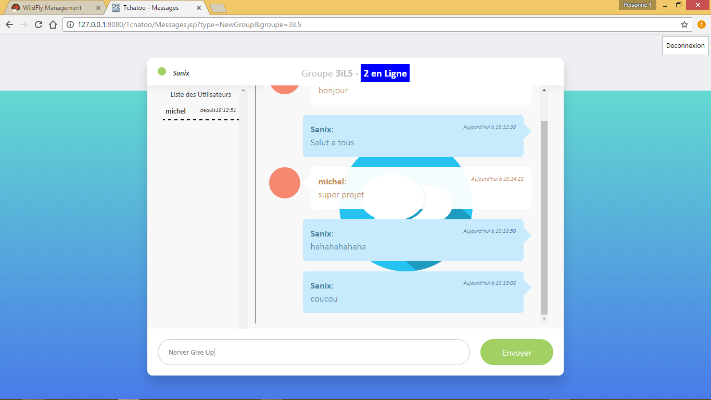

# Tchatto
Application de tchat entre amis et groupe d'amis (avec un noyau de generation dynamique de nouveau groupes si non existant) (JSP + Servlet + JAVA)

Projet ecrit sur <b>NetBeans</b> implementable avec <u>GlassFlish</u> ou <u>Wildfly</u> Tres simple a mettre en oeuvre et aussi tres utile:

## Exemple de rendu

 
<table style="width:100%;">
  <tr>
    <td></td>
    <td></td>
  </tr>
  <tr>
    <td colspan="2"></td>
  </tr>
</table>

## Auteur

- Sanix-darker